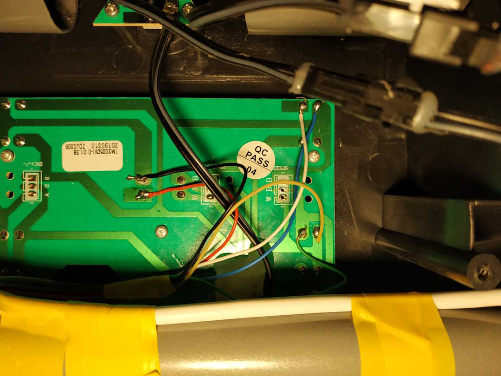
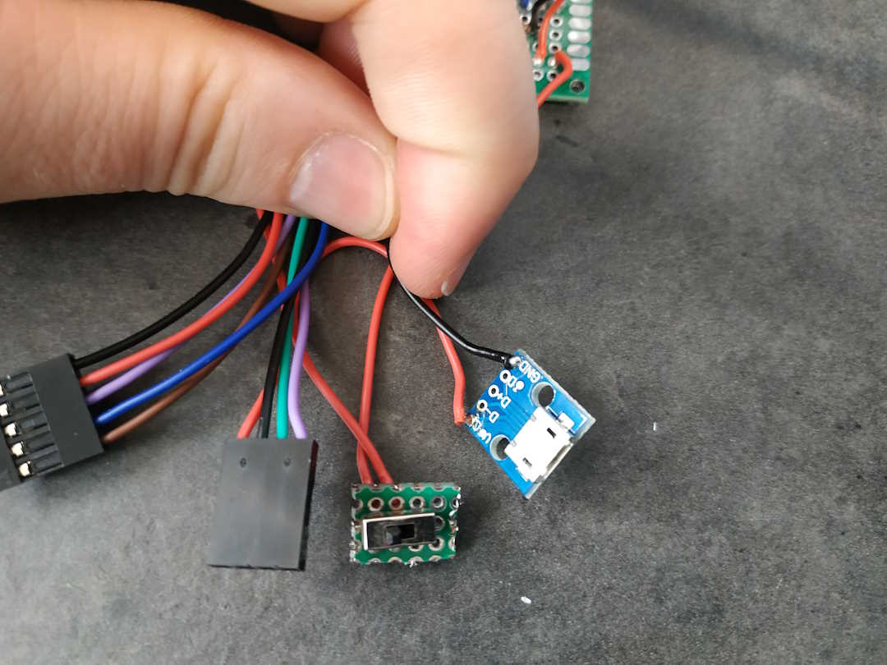

# treadmill-controller

## Try it in browser with a simulated arduino!
[Wokwi project](https://wokwi.com/projects/400015246220451841)

## Why is this project created?

I had two problems with my tredmill which I solved with a hardware button hack and an arudino uno.

[youtube video - during operation ](https://www.youtube.com/watch?v=EVUXpr3S0uo)

- Problem 1:
Speed setup

On my tredmill you can set an instant speed to 3, 6, 10, 16 Km/h and you can increase or decrase the speed by 0.1 Km/h, which sounds good until you want to run with the speed of 7.5 Km/h.  

In this case you have to set yout speed to 6 Km/h then increase your speed with 0.1 Km/h **15 times**!  
Like wise if you want to set speed to 4 km/h then you set your speed to 3 Km/h then increase your speed with 0.1 Km/h 10 times.

- Problem 2:
Workout timeings

I usualy do intervall based trainings for example this one which trains you for a 5Km run race if you are newer did any runing before:

| week | workout code | workout day 1 |workout day 2 |workout day 3 |
|----------|----------|----------|----------|----------|
| 1-2 | 2W&#124;[5&#124;1R&#124;2W] | 2 min walk -> 5X (1 min run -> 2 min walk) | same | rest |
| 3-4 | 2W&#124;[8&#124;1R&#124;1W]&#124;1W | 2walk -> 8X (1run, 1walk) -> 1walk | same | rest |
| 5 | 3W&#124;[4&#124;2R&#124;2W]&#124;1W | 3walk -> 4X (2run, 2walk) -> 1walk| same | same |
| 6 | 3W&#124;[5&#124;2R&#124;1W]&#124;1W | 3walk -> 5X (2run, 1walk) -> 1walk|rest | same |
| 7 | 4W&#124;[2&#124;2R&#124;1W&#124;3R&#124;2W] | 4walk -> 2X (2run, 1walk, 3run, 2walk)|rest | 45 min other workout |
| 8 | 4W&#124;[3&#124;3R&#124;2W]&#124;3W | 4walk -> 3X (3run, 2walk) -> 3walk| same | 45 min other workout |
| 9 | 4W&#124;[4&#124;3R&#124;1W]&#124;3W | 4walk -> 4X (3run, 2walk) -> 2walk| rest | rest |
| 10 | 5W&#124;[3&#124;4R&#124;2W]&#124;2W | 5walk -> 3X (4run, 2walk) -> 2walk| same | same |
| 11 | 5W&#124;[2&#124;5R&#124;2W]&#124;3R&#124;4W | 5walk -> 2X (5run, 2walk) -> 3run -> 4walk|same | 50 min other workout |
| 12 | 5W&#124;[2&#124;7R&#124;2W]&#124;2W | 5walk -> 2X (7run, 2walk) -> 2walk| rest | rest |
| 13 | 5W&#124;10R&#124;2W&#124;5R&#124;5W | 5walk -> 10run -> 2walk -> 5run -> 5walk|same | same |
| 14 | 5W&#124;15R&#124;6W | 5walk -> 15run -> 6walk | same | rest |
| 15 | 5W&#124;[4&#124;5R&#124;1W]&#124;2W | 5walk -> 4X (5run, 1walk) -> 2walk| rest | rest |
| 16 | 5W&#124;[3&#124;6R&#124;1W]&#124;4W | 5walk -> 3X (6run, 1walk) -> 4walk| same | same |
| 17 | 5W&#124;[3&#124;7R&#124;2W]&#124;4W | 5walk -> 3X (7run, 2walk) -> 4walk| same | same |
| 18 | 5W&#124;10R&#124;2W&#124;12R&#124;4W | 5walk -> 10run -> 2walk -> 12run -> 4walk | rest | rest |
| 19 | 5W&#124;[3&#124;9R&#124;1W] | 5walk -> 3X (9run, 1walk)| same | 60 min other workout |
| 20 | 5W&#124;15R&#124;2W&#124;[2&#124;5R&#124;2W] | 5walk -> 15run -> 2walk -> 2X (5run, 2walk)| same | same |
| 21 | 5W&#124;[3&#124;9R&#124;2W] | 5walk -> 3X (9run, 2walk)| same | same |
| 22 | 5W&#124;[3&#124;12R&#124;2W]&#124;4R&#124;4W | 5walk -> 3X (12run, 2walk) -> 4run -> 4walk| rest | 30 min other workout |
| 23 | 5W&#124;[3&#124;14R&#124;2W]&#124;2W | 5walk -> 3X (14run, 2walk) -> 2walk| rest | rest |
| 24 | 5W&#124;18R&#124;2W&#124;10R&#124;4W | 5walk -> 18run -> 2walk -> 10run -> 4walk  |same | 5 km race day |

So if we take week 3 which is a:  
2 min walk then 8X (1 min run then 1 min walk) then 1 min walk  
then would need to keep track of time and change between run and walk speed **18 times** and if you keep in mind the button press problem if you are an unfortunate invidual who walks at a speed of 4.5 Km/h and runs ant 7.5 Km/h then you will press buttons a woppin **15 x 18 = 270** times.  
This problem was screeaming for automation.

